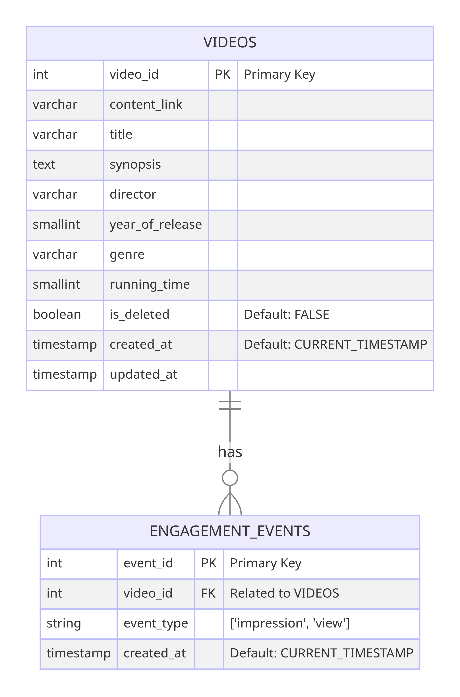

# video-streaming

This is a video streaming API.

The main purpose of the application is to:
* Store information related to videos
* Stream video content
* Keeps track of user engagement actions related to videos

## Decision

### Database

I have decided to create `Video` table and `EngagementEvent` table.
`Video` table is to manage information about video content, while `EngagementEvent` table tracks user engagement activities (such as views and impressions).



For local development, Docker is utilized for creating a consistent and isolated environment that mirrors production settings, ensuring that developers can work in a standardized setup.

### File(Video) upload

This time, due to the time constraints, I have decided to upload a file to the local directory. Ideally, file uploads should be handled using cloud-based storage services (like Amazon S3).

Uploading large files directly through an API can be time-consuming and may lead to timeouts or performance issues. Therefore, asynchronous processing such as a queue system can be utilized in the future.

## Assumption

Below is the assumption regarding request and response for each API.

### Publish a video API

The API to publish a video accepts a video file and returns the saved content.
The uploaded file is stored in the directory in this repository.

#### Example

```
% curl -X POST -F "file=@./{file-path}" http://localhost:8080/api/v1/videos

{"videoId":1,"title":null,"synopsis":null,"director":null,"yearOfRelease":null,"genre":null,"actor":null,"runningTime":null,"contentLink":"{file-path}","createdAt":"2024-01-21T09:15:04.605","updatedAt":"2024-01-21T09:15:04.605","engagementEventsCount":null,"deleted":false}
```

### Add and Edit the metadata associated with the video API

The API accepts a metadata and returns the saved content.

#### Example

```
% curl -X PUT http://localhost:8080/api/v1/videos/1 \
-H "Content-Type: application/json" \
-d '{
    "title": "test-title",
    "synopsis": "test-synopsis",
    "director": "test-director",
    "actor": "test-cast",
    "year_of_release": 2024,
    "genre": "drama",
    "running_time": 120
}'

{"videoId":1,"title":"test-title","synopsis":"test-synopsis","director":"test-director","yearOfRelease":2024,"genre":"drama","actor":"test-cast","runningTime":120,"contentLink":"test-video.mp4","createdAt":"2024-01-21T09:15:04.605","updatedAt":"2024-01-21T09:53:00.699","engagementEventsCount":{},"deleted":false}
```

### Delist API

The API accepts a videoId and soft delete the video item, the `is_deleted` flag become true.

#### Example

```
% curl -X DELETE http://localhost:8080/api/v1/videos/2
```

## Load a video API

The API accepts a videoId and returns the video metadata and the corresponding content.

#### Example

```
% curl -X GET http://localhost:8080/api/v1/videos/1

{"videoId":1,"title":"test-title","synopsis":"test-synopsis","director":"test-director","yearOfRelease":2024,"genre":"drama","actor":"test-cast","runningTime":120,"contentLink":"test-video.mp4","createdAt":"2024-01-21T09:15:04.605","updatedAt":"2024-01-21T11:37:01.59","engagementEventsCount":{"impression":3},"deleted":false}
```

## Play a video API

The API accepts a videoId and returns the content related to a video. The content is a URL to a video content.

#### Example

```
% curl -X GET http://localhost:8080/api/v1/videos/1/play

{"contentLink":"test-video.mp4"}
```

### List all available videos API

The API returns a list of video, but each content only a subset of the video metadata.

#### Example

```
% curl -X GET http://localhost:8080/api/v1/videos

{"videos":[{"videoId":1,"title":"test-title","synopsis":"test-synopsis","director":"test-director","yearOfRelease":2024,"genre":"drama","actor":"test-cast","runningTime":120},{"videoId":3,"title":"test-title-2","synopsis":"test-synopsis-2","director":"test-director-2","yearOfRelease":2023,"genre":"SF","actor":"test-cast-2","runningTime":150}]}
```

### Search for videos based on some search/query criteria

The API accepts a search query and returns a list of video that matches to the criteria.

#### Example

```
% curl -X GET "http://localhost:8080/api/v1/videos/search?synopsis=test"

{"videos":[{"videoId":1,"title":"test-title","synopsis":"test-synopsis","director":"test-director","yearOfRelease":2024,"genre":"drama","actor":"test-cast","runningTime":120},{"videoId":3,"title":"test-title-2","synopsis":"test-synopsis-2","director":"test-director-2","yearOfRelease":2023,"genre":"SF","actor":"test-cast-2","runningTime":150}]}

% curl -X GET "http://localhost:8080/api/v1/videos/search?title=2"

{"videos":[{"videoId":3,"title":"test-title-2","synopsis":"test-synopsis-2","director":"test-director-2","yearOfRelease":2023,"genre":"SF","actor":"test-cast-2","runningTime":150}]}

% curl -X GET "http://localhost:8080/api/v1/videos/search?title=1"

{"videos":[]}
```

### Retrieve the engagement statistic API

The API returns the engagement statistic for a video such as impressions and views.

#### Example

```
% curl -X GET http://localhost:8080/api/v1/videos/1/engagements

{"videoId":1,"impressionsCount":6,"viewsCount":2}
```

## Getting started

### Prerequisites

- JDK 17
- Docker version 24.0.5 or higher
- Docker Compose version v2.20.2-desktop.1 or higher

### Instructions on how to compile and run the solution

1. Set up the database

Run the following command

```
% docker compose up -d
```

2. Build the project

```
% ./gradlew build -x test
```

The test includes an integration test which requires the database for the testing.
Therefore, you can run the following command if you want to include the testing as well for the build command.

```
% docker compose -f test-compose.yaml up -d
% ./gradlew build
```

3. Run the application

```
% ./gradlew bootRun
```

### Unit test

```
% ./gradlew unit-test
```

### Integration test

```
% ./run-integration-test.sh
```

### Format

```
% ./gradlew spotlessJavaApply
```
